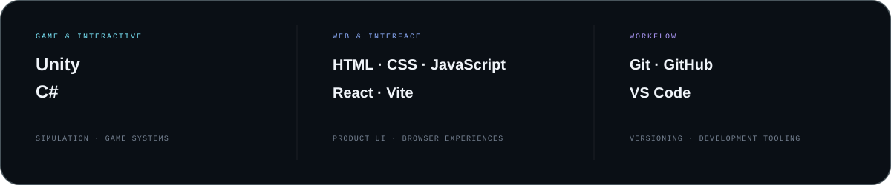

  

 

## 01 / SELECTED WORK

  
  
  

  Selected product, game/AI and interface work. Click a card to explore.

 

## 02 / CURRENTLY BUILDING

  

The simulator is being developed as a modular portfolio project rather than around a prebuilt flight framework. Input, physics, aircraft systems, telemetry and mission logic are being separated into explainable components that can evolve independently.

 

## 03 / ENGINEERING STACK

  

<strong>Additional experience</strong>

 

Python · FastAPI · Supabase · Docker · C++ · GlistEngine · Electron · Local LLM integrations

 

## 04 / ABOUT

I build software across **game systems, interactive interfaces and AI-assisted products**, with an emphasis on clear architecture and polished execution. I prefer small, understandable modules, deliberate technical decisions and documentation that makes a system easier to explain, maintain and extend.

 

## 05 / GITHUB ACTIVITY

  

 

## 06 / CONNECT

  <a href="mailto:mertkaankindar@hotmail.com"><strong>EMAIL ↗</strong></a>
  &nbsp;&nbsp;·&nbsp;&nbsp;
  <a href="https://github.com/Flonq"><strong>GITHUB ↗</strong></a>
  &nbsp;&nbsp;·&nbsp;&nbsp;
  <a href="https://scoovi.app/"><strong>SCOOVI ↗</strong></a>

 

  FLONQ / SOFTWARE ENGINEERING · GAME / AI / WEB SYSTEMS

