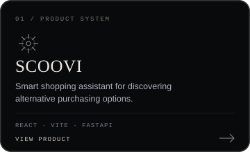
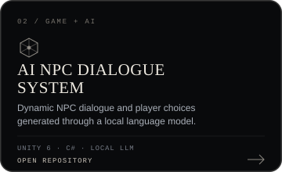
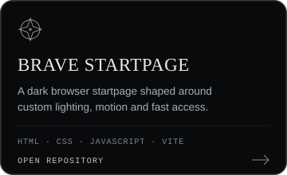
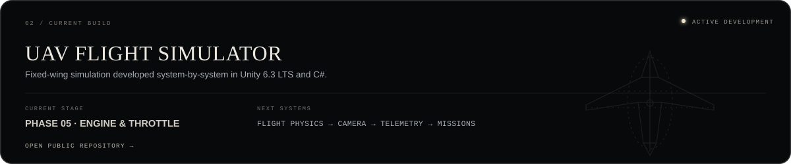
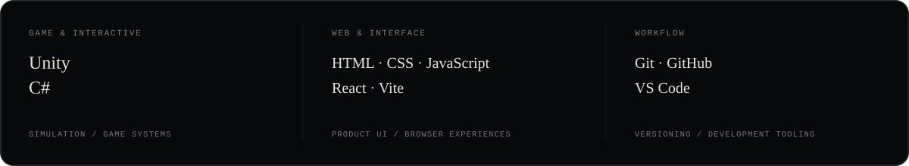

  

  
    <a href="#selected-work">SELECTED WORK</a>
    &nbsp;&nbsp;·&nbsp;&nbsp;
    <a href="#current-build">CURRENT BUILD</a>
    &nbsp;&nbsp;·&nbsp;&nbsp;
    <a href="#engineering-stack">STACK</a>
    &nbsp;&nbsp;·&nbsp;&nbsp;
    <a href="#about">ABOUT</a>
    &nbsp;&nbsp;·&nbsp;&nbsp;
    <a href="#connect">CONNECT</a>
  

 

## SELECTED WORK

  
  
  

 

## CURRENT BUILD

  

 

## ENGINEERING STACK

  

<strong>ADDITIONAL EXPERIENCE</strong>

 

Python · FastAPI · Supabase · Docker · C++ · GlistEngine · Electron · Local LLM integrations

 

## ABOUT

I build software across **game systems, interactive interfaces and AI-assisted products**. My work focuses on understandable architecture, deliberate technical decisions and software that feels complete rather than merely functional.

 

## GITHUB ACTIVITY

  

 

## CONNECT

  
    <a href="mailto:mertkaankindar@hotmail.com"><strong>EMAIL ↗</strong></a>
    &nbsp;&nbsp;&nbsp;·&nbsp;&nbsp;&nbsp;
    <a href="https://github.com/Flonq"><strong>GITHUB ↗</strong></a>
    &nbsp;&nbsp;&nbsp;·&nbsp;&nbsp;&nbsp;
    <a href="https://scoovi.app/"><strong>SCOOVI ↗</strong></a>
  

 

  FLONQ &nbsp;·&nbsp; SOFTWARE ENGINEERING &nbsp;·&nbsp; GAME / AI / WEB SYSTEMS

